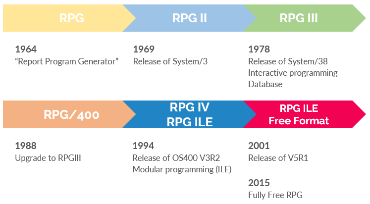

# Introduction to RPG

## History of RPG

- RPG was invented in the 60s.
- RPG III was first announced on system 38 in 1978.
- RPG IV was released in 1994 as part of V3R2.
- First Free Format RPG capabilities became possible in 2001 !
- Since V7R1 /Free and /End-Free are no longer needed.
- Since V7R1 + PTF's **fully free format** is available

### RPG IV - Fixed format
```
     FEMPLPF    IF   E           K DISK
     FEMPL101P  O    E             PRINTER OFLIND(*IN10)
     DTODAY            S               D   DATFMT(*ISO) INZ(*SYS)
     C                   MOVEL     *BLANKS       EMEMNO
     C     EMEMNO        SETLL     EMPLPF
     C     EMEMNO        READE     EMPLPF                                 90
     C     *IN90         DOWEQ     *OFF
     C                   IF        EMDTIN <= TODAY
     C                   WRITE     DETAIL01
     C                   ENDIF
     C     EMEMNO        READE     EMPLPF                                 90
     C                   ENDDO
     C                   SETON                                        LR                                    
```
- Position 6 represents the specification :
  - F > File specifications
  - D > Field definitions
  - I > Input specifications
  - C > Calculation specifications
  - O > Output specifications
  - P > Procedure specifications
- Positions within the specifications are predefined


### RPG IV - Fixed format combined with free format
```
     FEMPLPF    IF   E           K DISK
     FEMPL101P  O    E             PRINTER OFLIND(*IN10)

     DTODAY            S               D   DATFMT(*ISO) INZ(*SYS)

     C                   MOVEL     *BLANKS       EMEMNO
       /Free
       SETLL EMEMNO EMPLPF;
       READE EMEMNO EMPLPF;
       *IN90 = %EOF;
       DOW *IN90 = *OFF;
         IF EMDTIN <= TODAY;
           WRITE DETAIL01;
         ENDIF;
         READE EMEMNO EMPLPF;
         *IN90 = %EOF;
       ENDDO;
       /End-Free
      
     C                   SETON                                        LR
                                    
```
- Lot of legacy code exists of fixed format combined with free format
- Since V7R1 the /Free - /End-Free statements are no longer required
- Free format statement must end with semi-colon
- Identation for more readable code
- No more issues with length of field names or statements

### RPG IV - Fully free format
```
**FREE    
   
  dcl-f emplpf keyed;
  dcl-f empl101p printer oflind(*in10);
  dcl-s today date(*iso) inz(*sys); 
       
  clear ememno; 

  setll ememeno emplpf; 
  reade ememeno emplpf; 
  dow not %eof(emplpf); 
      if emdtin <= today; 
          write detail01;
      endif;
      reade ememeno emplpf; 
   enddo; 
      
   *inlr = *on;
```
- Fully free format RPG is recognized by the first line : **FREE should be on the first line and first position
- Specifations are replaced by the order of statements :
  - CTL-OPT : header / general specifications, often for the compiler
  - DCL-xx : declare statements for all kind of definitions
  - Calculation statements

### RPG IV - Free format comparison
| Free format RPG | Full free format RPG |
| ----------- | ----------- |
| Coding between position 8 and position 80 | Coding on ALL positions |
| Fixed Format and Free Format can be mixed | Only Free Format RPG is allowed |
| /Free and /End-Free can be used | /Free and /End-Free are forbidden ! |

### Advantages of RPG Fully Free Format
- Similar syntax to other programming languages (Java, JavaScript, PHP, Python, …)
- Easier to learn for new RPG programmers
- Lower cost to train programmers in other languages
- Easier to use for existing programmers


