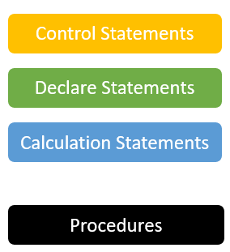
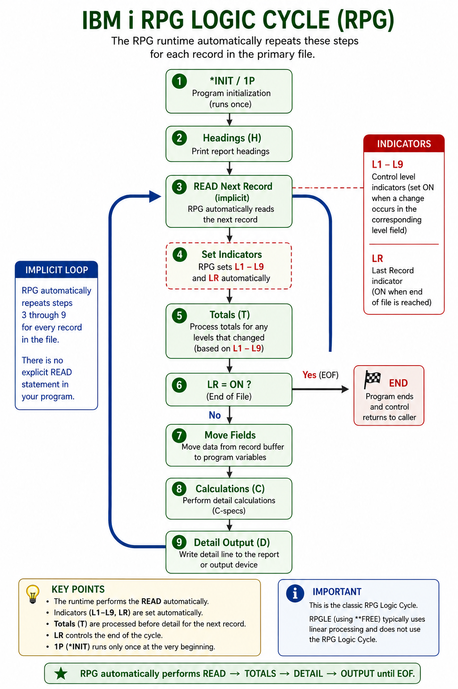
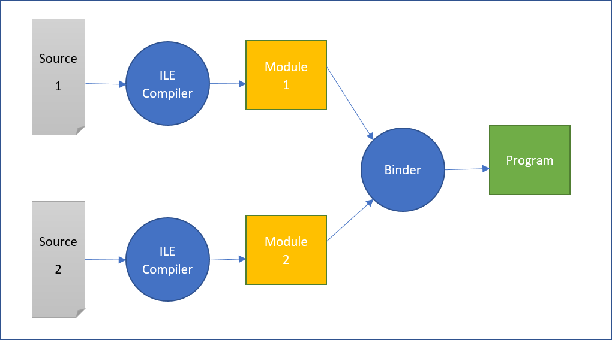

# Things to know about Free Format RPG

## Source file types

Fully Free Format RPG is an extension of the RPG IV format.

RPG IV sources can have two source file types : 

- `RPGLE` : default RPG IV sources
- `SQLRPGLE` : RPG IV with embedded SQL


## Basic programming rules
- Everything is free, except **FREE needs to be on line 1 / position 1, so the compiler recognizes the source as Fully Free RPG.
- All other statements have no limits on their positions.
- Fixed format is completely forbidden
- /Free and /End-Free tags are not allowed
- All lines end with a semi-colon, except for includes/copy statements
- One line can only contain one statement
- Statements can be written on one or multiple lines, but end with a semi-colon


## Program structure


A certain order of statements has to be respected : 
- Control statements (CTL-OPT)
- Declare statements (DCL-xx)
- Calculation statements
- Procedures

## Comments
```
**FREE       
   //  -------------------------------------------------------------------------
   //                            Employee maintenance
   //  -------------------------------------------------------------------------

       dcl-pi *n;
          pRtcd   char(1);      // Returncode 
          pAccd   char(2);      // Actioncode (01=New 02=Update 04=Delete)
          pData   char(2000);    
       end-pi;

```
- Comments always start with two slashes : //
- Comments can be put on a single line or can be put after a statement (useful for documentation).


## RPG logic cycle

The RPG logic cycle is the backbone of the old RPG programming language.
It's faded in recent years, but still needs to be understood by every RPG developer !



It used to be a logic to process all records in a file ('the primary file').

- Before the first record is read the first time through the cycle, the program resolves any parameters passed to it, does initialization and processes output operations (like printing the header lines).

- During the last time a program goes through the cycle, when no more records are available, the LR (last record) indicator is set on. 

When a program had no primary file involved, the LR indicator had to be set programmatically. Otherwise the program would run forever and start over again and again.

In Fully Free Format RPG, no primary files exist any more, but the RPG logic cycle is still there. Therefore programmers need to take it into account and set the LR indicator at the end of their program.

```
   *inlr = *on;
```

A full, classic fixed-format example (primary file, `L1`/`L2` control levels) is worked out in [additional/rpg-logic-cycle.md](additional/rpg-logic-cycle.md), as an illustration.

## Sending messages to the job log

As a new developer it can be handy to send messages to the job or job log.


### DSPLY

The `dsply` operation communicates messages directly to the workstation.

It displays a message and, optionally, halts program execution to accept a response from the user. It is most commonly used for quick field debugging or simple, low-effort console-style user interactions.

Note: the message is limited to 52 characters.

```
   dsply 'hello world';
```

### Number of parameters

`dsply` behaves differently depending on how many parameters are passed:

- Just the message (1 parameter): the message is written to the job log, but on the screen it only flashes briefly, the program does not wait for a reply.

```
   dsply 'hello world';
```

- A message and a response field (2 parameters): the program pauses at the `dsply` statement and waits for the user to answer.

```
   dcl-s response char(1);

   dsply 'Continue? (Y/N)' response;
```

- A message, an output queue and a response field (3 parameters): also waits for a reply, exactly like the 2-parameter form. The output queue (the second parameter, here left blank to use the default) lets a specific program message queue be targeted instead. The response the user types is captured into the third parameter, `response`.

```
   dcl-s response char(1);

   dsply 'Continue? (Y/N)' '' response;
```


### SND-MSG

The `snd-msg` operation is used to send a completion, diagnostic, informational, notification or status message.

The message appears in the joblog after it is sent unless the message type is *STATUS.

```
   // sends a informational message to the job log
   snd-msg 'hello world';   
   
   // sends an escape message to the job log
   snd-msg *ESCAPE 'File not found';  

   // sends a status message to the bottom of the screen
   snd-msg *STATUS 'No records processed';  
```

Note: `*ESCAPE` does more than just send a message, it also raises an exception and ends the program (unless the exception is monitored).

## Compiling a source into program

Sources are compiled during a two step process.



First the source is compiled into a module (*MOD).

Afterward the modules are bound into a program (*PGM) or service program (*SRVPGM).

### Default RPG programs

```
   // 1a. creating a module for a source member
   CRTRPGMOD MODULE(MYLIB/PGM01) SRCFILE(MYLIB/QRPGLESRC) SRCMBR(*MODULE)

   // 1b. creating a module for a source streamfile
   CRTRPGMOD MODULE(MYLIB/PGM01) SRCSTMF('/home/jurgen/qrpglesrc/pgm01.rpgle')

   // 2. binding a module into a program
   CRTPGM PGM(MYLIB/PGM01) MODULE(MYLIB/PGM01)

```

Although this is a two step process, IBM i provides a command to compile a source directly into a program.

```
   // creating a program for a source member
   CRTBNDRPG PGM(MYLIB/PGM01) SRCFILE(MYLIB/QRPGLESRC) SRCMBR(*MODULE)
```

### RPG programs with embedded SQL

Creation of a module on a source with embedded SQL requires the command `CRTSQLRPGI`. Creation of the program is still done by `CRTPGM`.

```
   // creating a module for a source member
   CRTSQLRPGI OBJ(MYLIB/PGM01) SRCFILE(MYLIB/QRPGLESRC) SRCMBR(*OBJ) OBJTYPE(*MODULE)

   // creating a module for a source streamfile
   CRTSQLRPGI OBJ(MYLIB/PGM01) SRCSTMF('/home/jurgen/qrpglesrc/pgm01.rpgle') OBJTYPE(*MODULE)

```

Also here, IBM i provides a command to compile a source directly into a program.

```
   // creating a program for a source member
   CRTSQLRPGI OBJ(MYLIB/PGM01) SRCFILE(MYLIB/QRPGLESRC) SRCMBR(*OBJ) OBJTYPE(*PGM)
```
