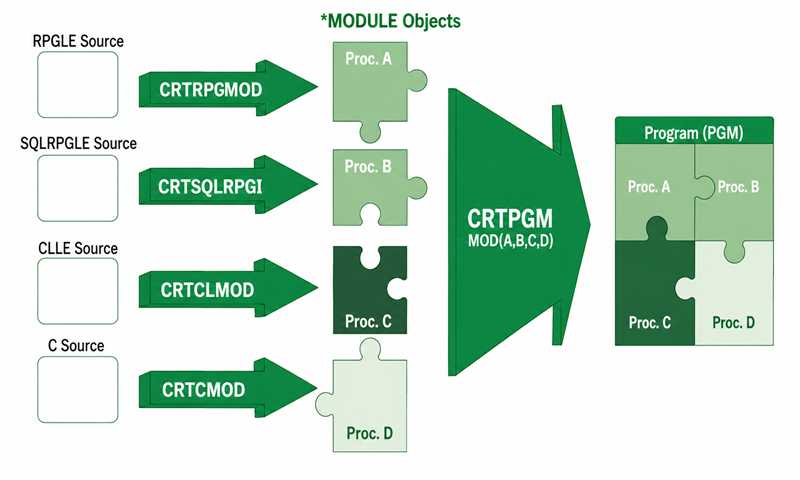
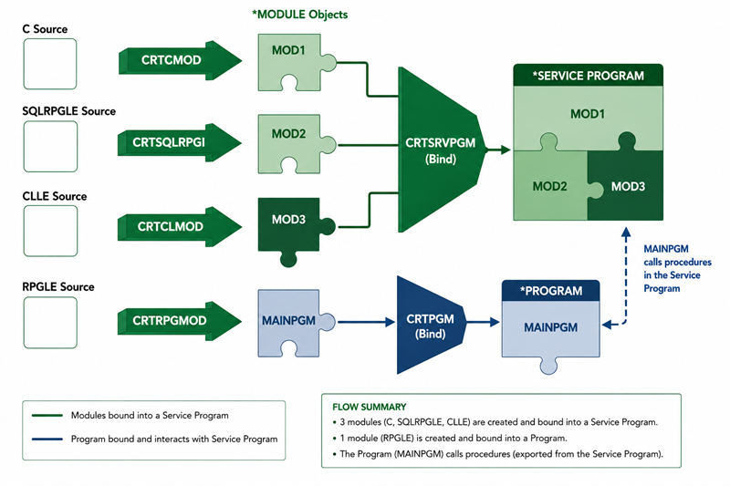

# External procedures (ILE concepts)

Internal procedures (see that chapter) live inside one program. This chapter covers the ILE concepts that let procedures be shared *between* programs: modules, service programs, and the activation groups and binding directories that tie it all together.


## Activation groups

An activation group is the memory space and set of resources (open files, allocated storage, ...) a program runs in.

### Default activation group (OPM)

Historically (OPM, the Original Program Model), every program ran in the one single, default activation group. When a program is called:

- The program is loaded into memory.
- Files are opened.
- Variables are initialized.
- ...

Unloading (releasing all of this again) happens when `*inlr` (LR) is set on.

### Named activation groups (ILE)

ILE adds the ability to create separate, named activation groups. A group of related programs can then be loaded and unloaded together, as one unit, independently from everything else running in the same job, a "job within a job".

- Programs sharing a named activation group are loaded and unloaded together.
- `*inlr` still works the same as before, closing files and reinitializing variables for that one program, it does not by itself unload the whole activation group.

### Unloading programs compared to taking out the trash

- Carrying it out piece by piece, one trip at a time, to the dumpster: each program turning on `*inlr` individually.
- Taking the truck into the house and loading everything into it in one go: the `RCLRSC` command, reclaims the resources of every program currently in the call stack at once.
- Waiting until everything in the house is done, then throwing the whole house away: `SIGNOFF`, ending the entire job destroys everything in it.
- Collecting everything into one bag, then carrying just that bag to the dumpster: an **activation group**. Everything sharing that named activation group can be reclaimed (`RCLACTGRP`) or ended together, as one unit, without touching the rest of the job.

### Programs are compiled with an activation group

- `ACTGRP(*NEW)`: a brand new activation group is created every time the program is called, and destroyed again when the program ends.
- `ACTGRP(*CALLER)`: the activation group of whichever program called this one is reused. When there is none (for example, called from a command line), the default activation group is used instead.
- `ACTGRP(name)`: a specific, named activation group is used (created the first time it is needed). It stays around until explicitly destroyed with `RCLACTGRP`, or until sign-off.

The activation group is set either on the compile command, or with `ctl-opt`:

```
    CRTBNDRPG PGM(WRKORD)    DFTACTGRP(*NO) ACTGRP(*NEW)
    CRTBNDRPG PGM(WRKORDDET) DFTACTGRP(*NO) ACTGRP(*CALLER)
```

```
    ctl-opt dftactgrp(*no) actgrp('GCP');
```


## Modules

A `*MODULE` is the direct output of compiling one RPG (or C, COBOL, ...) source, it groups one or more procedures together. A module is not directly callable by itself, it first needs to be bound into a program or a service program.

- `nomain`: a module can be compiled with no main/cycle-based entry point at all (`ctl-opt nomain;`), it then only exports procedures, and has no program logic of its own to run.
- Binding one or more modules together produces a `*PGM` object:



- Binding modules into a program copies their compiled code into that program ("bind by copy"), the modules become part of the program itself.
- Because of that copy, changing one of the modules means every program that was bound with it has to be recreated, to pick up the change. With many programs sharing the same module, this quickly becomes a maintenance problem, which is exactly what service programs (below) solve.


### Prototypes

Prototypes for a module's procedures are typically kept in their own source member, and pulled into every module that needs them with `/copy` (or `/include`, the two behave identically), instead of being retyped by hand everywhere. This is what keeps a procedure's prototype and its actual implementation in sync, even though they live in different, separately compiled source members.

```
   // member QCPYSRC(MATHUTIL_H) : the prototype, shared by everyone

   dcl-pr roundAmount packed(9:2) extproc;
      pAmount packed(9:4) const;
   end-pr;
```

The module implementing the procedure `/copy`'s the exact same member, so the compiler can check that `dcl-pi` really matches the prototype:

```
   // member QRPGLESRC(MATHUTIL) : the module implementing it

   ctl-opt nomain;

   /copy qcpysrc,mathutil_h

   dcl-proc roundAmount;
      dcl-pi *n packed(9:2);
         pAmount packed(9:4) const;
      end-pi;

      return %dec(pAmount:9:2);         // rounds to 2 decimals
   end-proc;
```

A calling program `/copy`'s that same member as well, then calls the procedure exactly like an internal one:

```
   // member QRPGLESRC(ORDER001) : a program calling it

   ctl-opt dftactgrp(*no) actgrp(*caller);

   /copy qcpysrc,mathutil_h

   dcl-s wRounded packed(9:2);

   wRounded = roundAmount(12.3456);

   dsply wRounded;                      // 12.35

   *inlr = *on;
```

Both modules still need to be bound together into one program, this is done directly on the compile/bind command, no binding directory (further below) is needed for that:

```
CRTRPGMOD MODULE(MYLIB/ORDER001) SRCFILE(MYLIB/QRPGLESRC)
CRTRPGMOD MODULE(MYLIB/MATHUTIL) SRCFILE(MYLIB/QRPGLESRC)

CRTPGM PGM(MYLIB/ORDER001) MODULE(MYLIB/ORDER001 MYLIB/MATHUTIL)
```

- `extproc` without a value (unlike `extproc('sleep')` in the Calling programs and API's chapter) simply means: this prototype calls a bound procedure with the exact same name, the usual case for a project's own modules.
- `nomain` (see above) is what makes `MATHUTIL` a pure procedure module, with no program logic of its own.
- `MODULE(MYLIB/ORDER001 MYLIB/MATHUTIL)` is where the actual binding happens, both modules are listed explicitly and copied into the one program object, exactly as described above.
- `dftactgrp(*no)` / `actgrp(*caller)` are still needed because this uses ILE procedures (see Activation groups, above), a binding directory only becomes useful once a service program is involved (see further below).


## Service programs

A service program (`*SRVPGM`) also groups one or more modules together, but instead of being copied into every caller, it stays a separate, shared object that many programs can call, bound "by reference".



- Created with `CRTSRVPGM`, changed with `UPDSRVPGM`.
- A regular program has one entry point, the program entry, called with `CALL`. A service program has multiple entry points instead, one per exported procedure, each called directly as a procedure call.
- Because of that, a service program cannot be called from the command line, there is no single program entry to call.
- A procedure called in a service program is *not* copied into the calling program, only a reference to the service program is kept. This is what solves the maintenance problem from the Modules section above: as long as its interface does not change, the service program can be recreated on its own, without recreating every program that calls it.

### Export signature

A service program carries an export signature, visible with `DSPSRVPGM`, essentially a fingerprint of its exported procedures. This signature gets baked into every program that binds to it at compile time.

- If the service program's signature later changes incompatibly, programs that call it start failing at run time with a "signature violation", conceptually similar to a level check mismatch on a database file.
- A signature violation can be resolved by:
  - Recreating the calling program (always works, but means recompiling every caller).
  - The `UPDPGM` command (re-links the program against the new service program, without a full recompile from source).
  - Using binder language (below) to keep the signature under control in the first place.

### Binder language

A service program can contain many subprocedures, only the ones marked `export` are callable from outside it. Binder language explicitly lists which procedures are exported, and assigns the export signature by hand, instead of leaving it entirely up to the compiler. The binder source typically has the same name as the service program, and is kept in `QSRVSRC`.

```
STRPGMEXP PGMLVL(*CURRENT) SIGNATURE('BASE64R4 V1.00  ')
   export symbol(base64_encode)
   export symbol(base64_decode)
ENDPGMEXP
```

- `PGMLVL(*CURRENT)` defines the current signature, older signatures can be kept alongside it (`PGMLVL(*PREV)`) so that programs bound against an earlier version keep working.
- Each `export symbol(...)` line makes one procedure callable from outside the service program.
- Adding a new procedure as a new `export symbol` line does not change the existing signature, so existing callers are unaffected, this is the disciplined way to grow a service program over time without causing signature violations.


## Binding directories

A binding directory is a named list of modules and service programs. Instead of a program listing every module or service program it needs individually, it just refers to the binding directory, with the same `bnddir` keyword already used earlier in this course (`ctl-opt bnddir('QC2LE');`, to reach the C runtime library).

```
CRTBNDDIR BNDDIR(MYLIB/MYPGMS)
ADDBNDDIRE BNDDIR(MYLIB/MYPGMS) OBJ((MYLIB/BASE64 *SRVPGM))
```

```
   ctl-opt bnddir('MYPGMS');
```

- `CRTBNDDIR` creates a new, empty binding directory.
- `ADDBNDDIRE` adds one entry (a module or a service program) to it, `WRKBNDDIRE` lists and manages the entries already in one.
- Once a service program is listed in a binding directory a program uses, any of its exported procedures can be called directly, without that program needing to know exactly which service program it came from.


## Putting it together

The same `roundAmount` module from the Modules section, now shared through a service program instead of being bound directly into every program that needs it. The module itself does not change at all:

```
   // member QRPGLESRC(MATHUTIL) : the module, exactly as before

   ctl-opt nomain;

   /copy qcpysrc,mathutil_h

   dcl-proc roundAmount;
      dcl-pi *n packed(9:2);
         pAmount packed(9:4) const;
      end-pi;

      return %dec(pAmount:9:2);         // rounds to 2 decimals
   end-proc;
```

Instead of binding it straight into a program, it is bound into a service program, together with binder source to control its export signature:

```
   // member QSRVSRC(MATHUTIL) : the binder source

   STRPGMEXP PGMLVL(*CURRENT) SIGNATURE('MATHUTIL V1.00  ')
      export symbol(roundAmount)
   ENDPGMEXP
```

```
CRTRPGMOD MODULE(MYLIB/MATHUTIL) SRCFILE(MYLIB/QRPGLESRC)

CRTSRVPGM SRVPGM(MYLIB/MATHUTIL) MODULE(MYLIB/MATHUTIL) SRCFILE(MYLIB/QSRVSRC)
```

The service program is added to the same binding directory used above, instead of every calling program having to name it individually:

```
ADDBNDDIRE BNDDIR(MYLIB/MYPGMS) OBJ((MYLIB/MATHUTIL *SRVPGM))
```

The calling program's RPG source does not change either, it still `/copy`'s the same prototype and calls `roundAmount` the same way, it now just adds `bnddir('MYPGMS')`:

```
   // member QRPGLESRC(ORDER001) : a program calling it

   ctl-opt dftactgrp(*no) actgrp(*caller) bnddir('MYPGMS');

   /copy qcpysrc,mathutil_h

   dcl-s wRounded packed(9:2);

   wRounded = roundAmount(12.3456);

   dsply wRounded;                      // 12.35

   *inlr = *on;
```

```
CRTRPGMOD MODULE(MYLIB/ORDER001) SRCFILE(MYLIB/QRPGLESRC)

CRTPGM PGM(MYLIB/ORDER001) MODULE(MYLIB/ORDER001)
```

- Both the module's and the calling program's RPG source are completely unchanged from the plain-module version earlier, only the `CRT...` commands, and the `bnddir` on `ctl-opt`, differ.
- Because `MATHUTIL` is resolved through the binding directory (in `ctl-opt`) rather than named directly on `CRTPGM`, `ORDER001` does not even need to be recreated if `MATHUTIL` is later replaced by a different service program with the same exported procedures, only the binding directory entry would need to change.
- This binds by reference, exactly like `BNDSRVPGM` would: `ORDER001` only keeps a pointer to `MATHUTIL`, it is not copied in. `MATHUTIL` can be recreated on its own (a bug fix, for example) without ever touching `ORDER001` again, as long as its export signature does not change.
