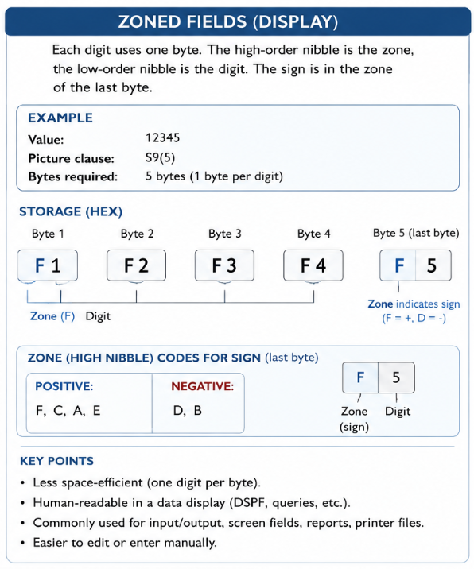
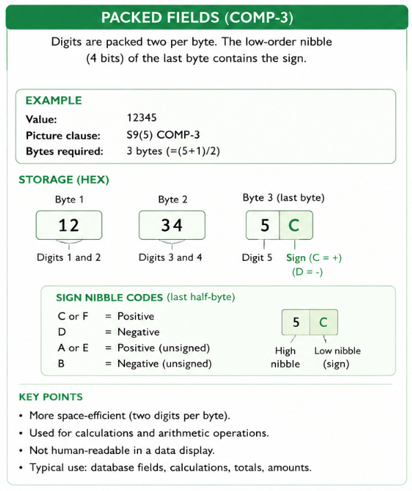

# Fields

This chapter covers how to declare and use the building blocks of every RPG program: constants, stand alone fields and arrays.


## Constants

A constant is a named value that never changes during the execution of a program. Using constants instead of literal values makes code easier to read and easier to maintain, because the value only has to be changed in one place.

```
   dcl-c SUCCESS                            const(0); 
   dcl-c ITEM_NOT_FOUND                     const(-101);  
   dcl-c INACTIVE_ITEM                      const(-102);
                    
   dcl-c MAX_ATTEMPTS                       3;
   dcl-c COMPANY_NAME                       'CDINVEST';
   dcl-c VAT_RATE                           21.00;
                    
   dcl-c INTERACIVE                         'I';     // I=Interactive job     
   dcl-c BATCH                              'B';     // B=Batch job
   
```

- A constant is declared with `dcl-c`, followed by the name and the value.
- No type needs to be specified, RPG determines the type based on the value.
- A constant cannot be changed once compiled, an attempt to do so results in a compile error.


## Stand alone fields

A stand alone field is a single, independent field (as opposed to a field that is part of a data structure or a file). It is declared with `dcl-s`, followed by the name and the type.

### Field types

| Type | Keyword | Example | Notes |
| --- | --- | --- | --- |
| Zoned decimal | `zoned(l:d)` | `dcl-s wAmount zoned(7:2);` | `l` = total length, `d` = decimal positions |
| Packed decimal | `packed(l:d)` | `dcl-s wAmount packed(7:2);` | Same as zoned, stored more compact |
| Indicator | `ind` | `dcl-s wFound ind;` | Only `*on` / `*off` |
| Character | `char(l)` | `dcl-s wName char(20);` | Fixed length, always padded with blanks |
| Varchar | `varchar(l)` | `dcl-s wName varchar(20);` | Variable length, only stores the actual characters |
| Pointer | `pointer` | `dcl-s wPtr pointer;` | Holds a memory address |
| Integer | `int(n)` | `dcl-s wCount int(10);` | Signed, `n` = 3/5/10/20 (1/2/4/8 bytes) |
| Unsigned | `uns(n)` | `dcl-s wCount uns(10);` | Same sizes as `int`, no negative values |
| Date | `date` | `dcl-s wDate date;` | Format controlled with `datfmt` |
| Time | `time` | `dcl-s wTime time;` | Format controlled with `timfmt` |
| Timestamp | `timestamp` | `dcl-s wStamp timestamp;` | Date + time, up to microseconds |

```
   dcl-s wAmount   packed(7:2);
   dcl-s wFound    ind;
   dcl-s wName     varchar(20);
   dcl-s wCount    int(10);
   dcl-s wOrderDte date(*iso);
   dcl-s wStartTim time(*iso);
   dcl-s wCreatTst timestamp;
```

We can also use constants to define the variable length.

```
   dcl-c URL_LENGTH   const(50);

   dcl-s uri          char(URL_LENGTH);
```

We can refer also refer to another field instead of defining the type of the field. 
Therefor we need to use the keyword `like`.

```
   dcl-s firstname                 varchar(30);
   dcl-s lastname                  like(firstname);
   dcl-s callname                  like(firstname);
```


### Character fields

There are three kinds of character fields :
- CHAR(number-of-characters)
- VARCHAR(maximum-number-of-characters)
- IND

```
   dcl-s name                   char(20);
   dcl-s company                char(30) inz('CD-Invest');
   dcl-s address                varchar(128);
   dcl-s eof                    ind;

   name = 'Jürgen Desmidt';
   eof = '0'; 	                     // or eof = *off;
```

### Numeric fields

The most common field types for numeric fields are :
- PACKED( total-length ) or PACKED( total-length : decimal-positions)
- ZONED( total-length ) or ZONED( total-length : decimal-positions)
- INT( digits )
- UNS( digits )

```
   dcl-s param1             packed(7:2);
   dcl-s param2             packed(7);

   dcl-s quantity           zoned(9);

   dcl-s length             uns(3);              // INT and UNS can have a length 
   dcl-s returncode         int(10) inz(0);      // of 3, 5, 10 or 20 digits 
```


**ZONED = zoned fields**

- Decimal positions can be left behind, when there are none.




**PACKED = packed fields**

- Packed fields store two numeric digits per byte, making them more space-efficient and faster for calculations than zoned fields.
- Decimal positions can be left behind, when there are none




**INT = signed integer**

- INT(3) = range from -128 to +127
- INT(5) = range from 2768 to +32767
- INT(10) = range from -2147483648 to +2147483647
- INT(20) = range from -9223372036854775808 to +9223372036854775807


**UNS = unsigned integer**

- UNS(3) = range from 0 to 255
- UNS(5) = range from 0 to 65535
- UNS(10) = range from 0 to to 4294967295
- UNS(20) = range from 0 to to 18446744073709551615

### Pointers

```
  dcl-s ptr1 pointer;
  dcl-s ptr2 pointer;
  dcl-s myField char(10) based(ptr1);
```

// Claude : add explanation of a pointer
// Claude : explain based keyword


### Initializing a field

The `inz` keyword sets a starting value for a field. Without `inz`, RPG uses a default starting value depending on the type (blanks for character fields, zero for numeric fields, `*off` for indicators, ...).

```
   dcl-s wAmount packed(7:2)            inz(0);
   dcl-s wName   varchar(20)            inz('N/A');
   dcl-s wToday  date                   inz(*sys);
```
When we speficy `inz` keyword without value, the field will be initialized with it's default value.

Certain field types (like INT or VARCHAR) have undefined data when they are not initialized. 
For most practical purposes, always coding INZ explicitly is the safer habit if you rely on a known starting value since the "default" behavior differs between standalone field types.


## Manipulating fields

### Eval

The `eval` operation assigns the result of an expression to a field. In Fully Free Format RPG, the keyword `eval` itself is optional: a statement that starts with a field name followed by `=` is automatically treated as an assignment.

```
   eval wAmount = 100.50;
   wAmount = 100.50;             // identical to the line above, eval is implicit

   wAmount = wAmount + 10;
   wName   = 'Jurgen';
```

// Claude: add explanation and examples of evalr and eval(h)

### Compound assignment operators

RPG also supports the shorthand operators `+=`, `-=`, `*=` and `/=`.

```
   wAmount += 10;                 // wAmount = wAmount + 10
   wAmount -= 5;                  // wAmount = wAmount - 5
   wAmount *= 2;                  // wAmount = wAmount * 2
   wAmount /= 4;                  // wAmount = wAmount / 4
```


## Arrays

An array is a stand alone field that holds multiple values of the same type, using the `dim` keyword to specify the number of elements.

```
   dcl-s wMonth char(9) dim(12);
```

### Initializing an array

Every element can be initialized individually with `inz`, or all elements can get the same starting value.

```
   dcl-s wScore packed(3:0) dim(5) inz(0);   // all 5 elements start at 0
```

### Using an array

Elements are addressed with the field name, followed by the index between parentheses. The first element has index 1.

```
   dcl-s wMonth char(9) dim(12);

   wMonth(1)  = 'January';
   wMonth(2)  = 'February';
   wMonth(3)  = 'March';

   dsply wMonth(1);              // shows 'January'
```

- The index must be between 1 and the number of elements defined with `dim`.
- Arrays declared this way are static: the number of elements is fixed at compile time.
